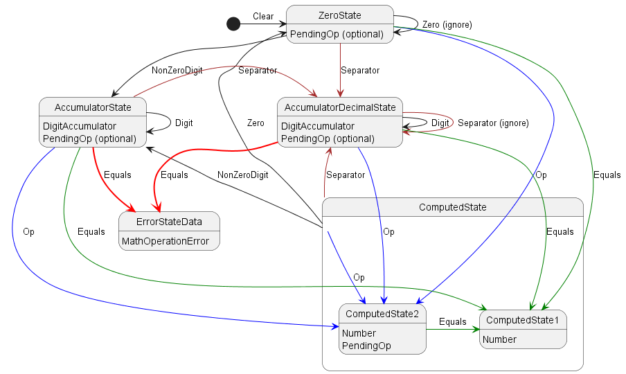

# Calculator Walkthrough

For practice purpose, reproduce the results demonsted in [the original article](https://swlaschin.gitbooks.io/fsharpforfunandprofit/content/posts/calculator-design.html).

Development environment:
- Windows 10
- .NET Framework 4.8
- F# 6.0
- F# Interactive 12.0.4.0
- VSCode + Ionide extension

## Overview
- First, execute `dotnet new console -lang "F#" -o calculator_walkthrough`.
- Understand the domain, translate it into the states ("nouns") and the transitions ("verbs").
  - The state represents a possible configuration of the app.
  - The transition is represented by a function `(input, state) -> state`.
- Draw State Machine diagram.
  
- Implement types and "real-code", check if the domain assumption works, go back to the previous stage if it is needed.
